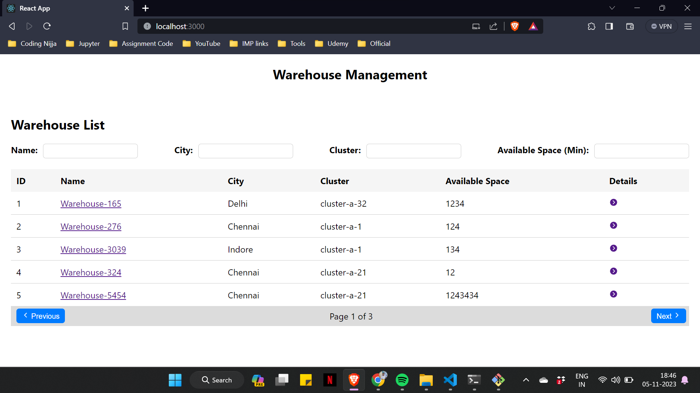
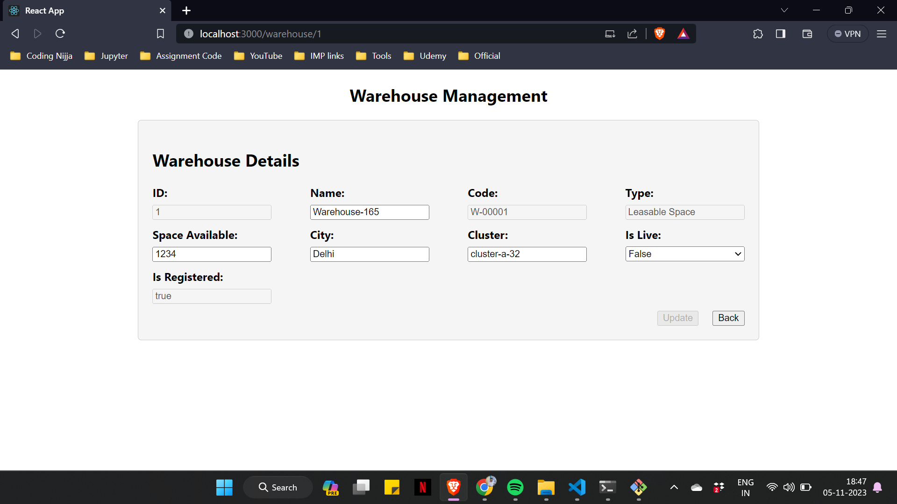

# Warehouse Listing App

The Warehouse Listing App is a React-based web application for managing and listing warehouses. It provides features to view a list of warehouses, search by warehouse name, filter by city, cluster, and available space, view warehouse details, and edit warehouse information. The application uses React, React Router, Redux for state management, and styled-components for styling.

## Features

- View a list of warehouses with key information.
- Search warehouses by warehouse name.
- Filter warehouses based on city, cluster, and available space.
- View detailed information for each warehouse.
- Edit warehouse details such as cluster, warehouse name, city, space available, and warehouse live status.
- Proper routing using React Router for navigation.
- State management using Redux.
- Responsive and styled user interface with CSS and styled-components.
- Efficient data handling and optimized store calls.

## Installation

To run the Warehouse Listing App locally, follow these steps:

1. Clone the repository:
    git clone https://github.com/yourusername/warehouse-listing-app.git

2. Navigate to the project directory:
    cd warehouse-listing-app

3. Install dependencies:
    npm install

4. Start the development server:
    npm start

5. Use application:
    Open your browser and visit http://localhost:3000 to access the app.

## Usage

- Browse the list of warehouses.
- Use the search bar to search for a specific warehouse by name.
- Apply filters to narrow down the list based on city, cluster, and available space.
- Click on a warehouse to view its details and edit information if needed.

## ScreenShot

